# Ejercicios de autoevaluación de IV

## Hito 4

**Ejercicio 9** Sistemas de integración continua.

> Darse de alta en alguno. Muchos están conectados con GitHub por lo que puedes autentificarte directamente desde ahí. A través de un proceso de autorización, puedes acceder al contenido e incluso informar del resultado de los tests a GitHub.
  
Para ello me fui a [este enlace](https://travis-ci.org), pulsé registrarme desde GitHub y como ya lo había hecho anteriormente para otros repos me salió directamente:
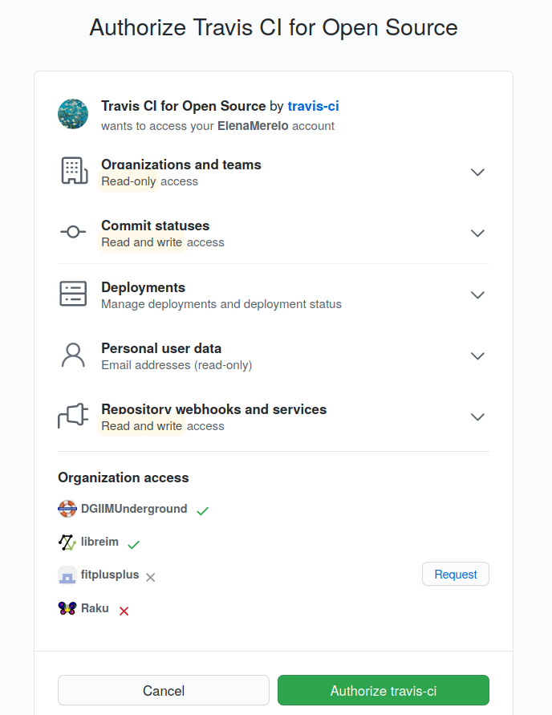 

> Activar el repositorio en el que se vaya a aplicar la integración continua. Travis permite hacerlo directamente desde tu configuración; en otros se dan de alta desde la web de GitHub.

Desde la página a la que fui redirigida automáticamente, le di al icono de `+` para añadir el repositorio al que quiero que se haga integración continua: 

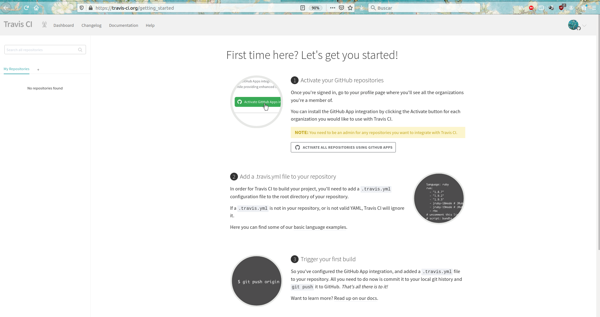

Busqué goFit entre ellos, y le di al botoncico 

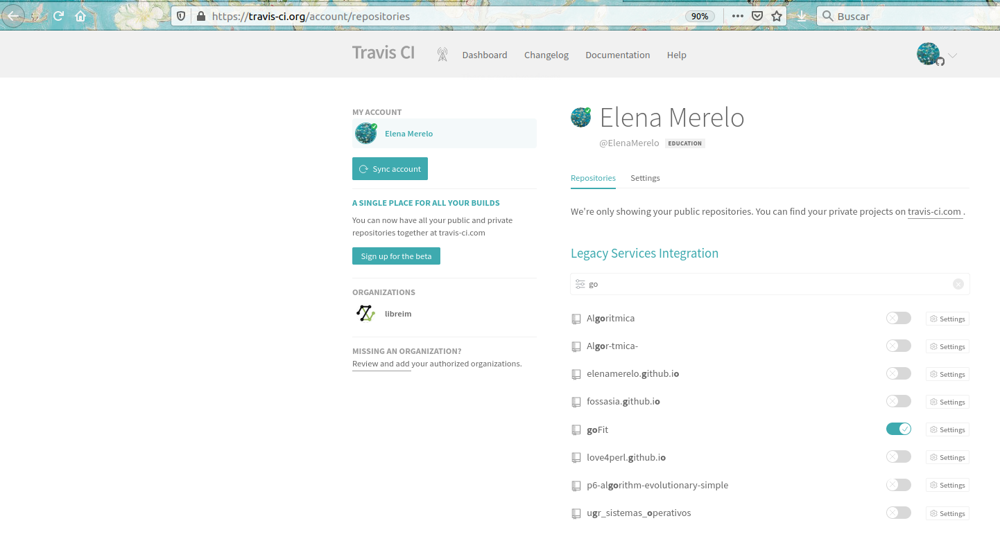

**Ejercicio 10** Configurar integración continua para nuestra aplicación usando Travis o algún otro sitio.

Añado un fichero `.travis.yml` al directorio raíz de mi directorio

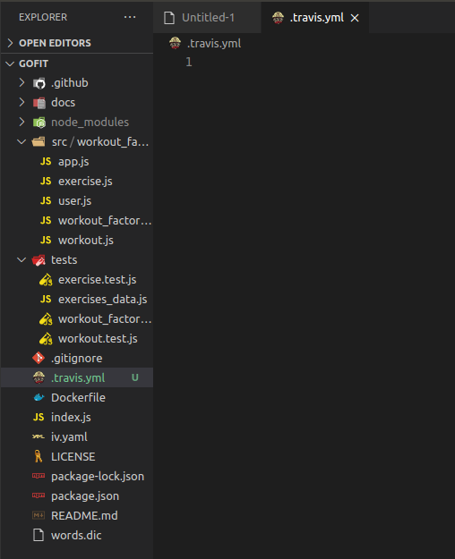 

- En `language` indico que es `nodeJS`
- En `node_js` indico la versión que tiene que usar. Yo uso la versión 14.13.0, por eso pongo `14`.
- En `before_install` indico lo que tiene que hacer antes de que instale la aplicación. Instalo pues `ava` y el resto de dependencias.
- En `script` ponemos la orden que queremos que corra. 

Queda finalmente:

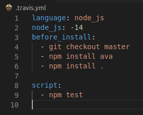

## Hito 5 
**Ejercicio 1** Darse de alta en Vercel y Firebase, y descargarse los SDKs para poder trabajar con ellos localmente.
Me voy a [la página web de Vercel](vercel.com) y me registro con Github: 

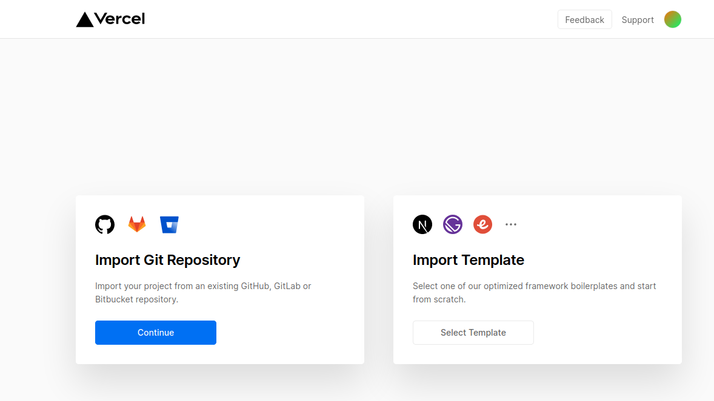 

Con lo que ya tengo mi perfil creado: 

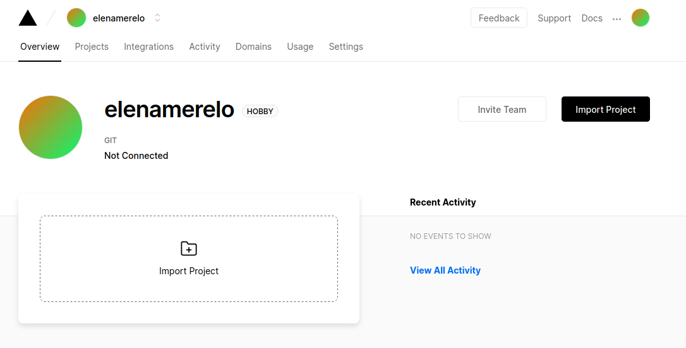

Instalamos la CLI de vercel con `npm i -g vercel` 

Para darme de alta en Firebase también me voy a la página web, me logeo con la cuenta de google y a volar: 

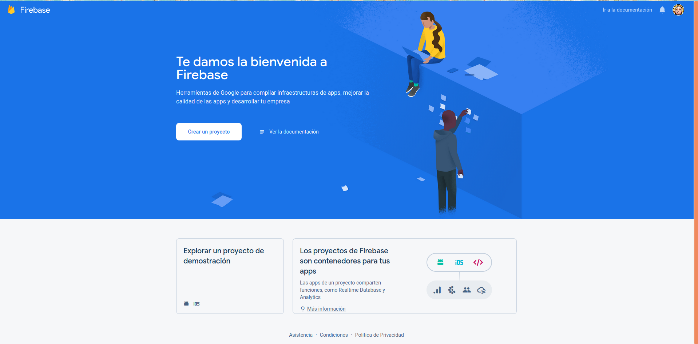 

Añadimos elEl SDK de administrador Node.js de Firebase con `npm install firebase-admin --save`

**Ejercicio 2**  Tomar alguna de las funciones de prueba de Vercel, y hacer despliegues de prueba con el mismo.

En mi dashboard de vercel, le doy a projects y una vez ahí a importar proyecto: 

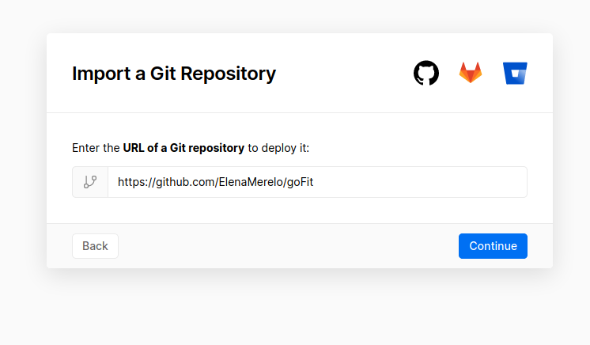

Instalo vercel en mi GitHub:

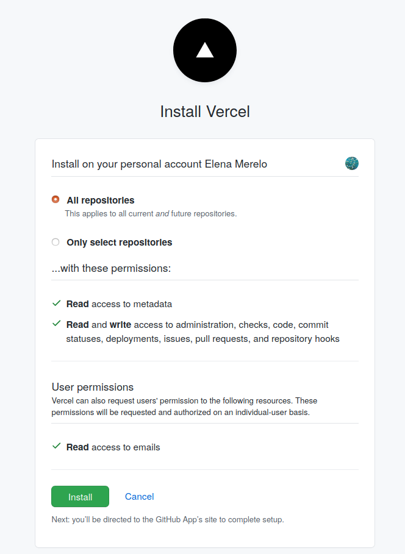 

Et voi là: 

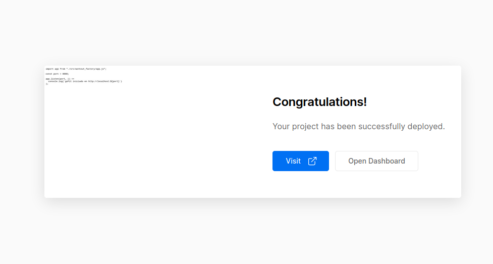

Creo un ejemplo básico para probar si funciona: 

~~~ 
module.exports = (req, res) => {
  res.send(`Hi there!`);
};
~~~ 

Me conecto con vercel: 

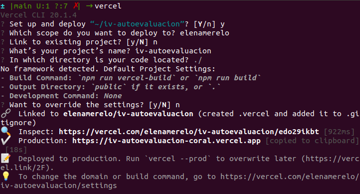

Y vemos que ha funcionado woohoo: 

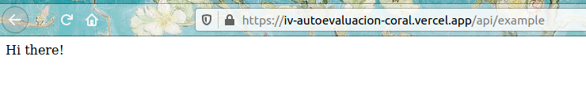

**Ejercicio 3** Tomar alguna de las funciones de prueba de Netlify, y hacer despliegues de prueba con el mismo.

Me registro también con GitHub: 

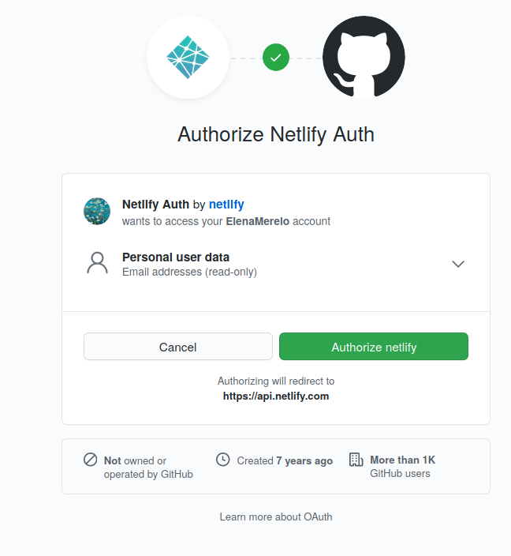

Y ya tengo mi página, más bonica que tó: 

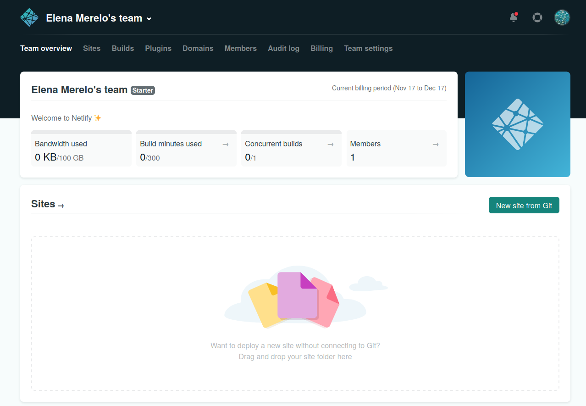

Instalo la CLI: 

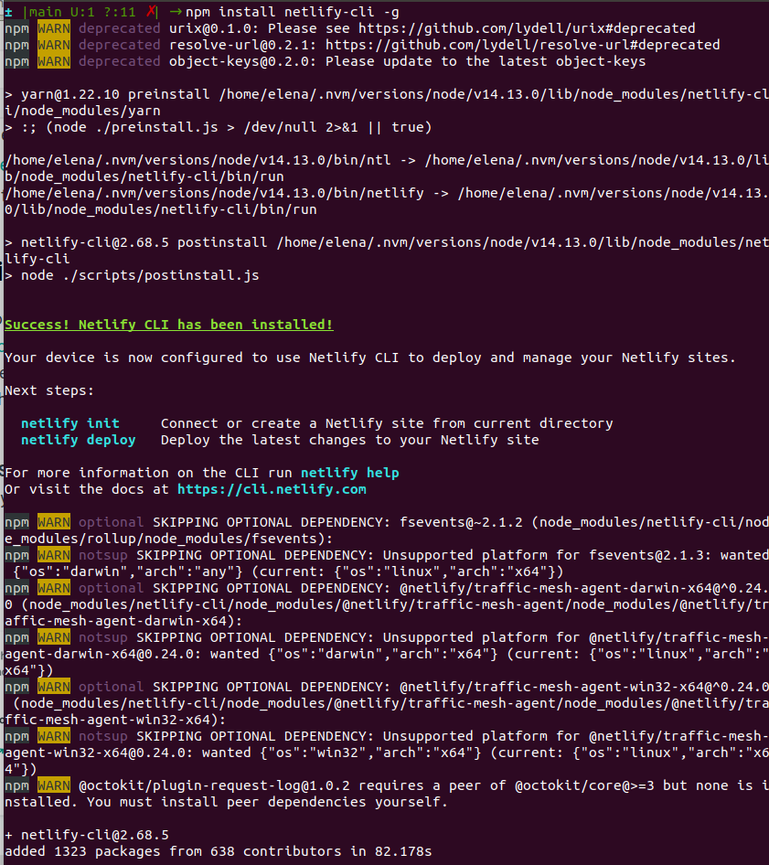

Para lanzar un ejemplo: 

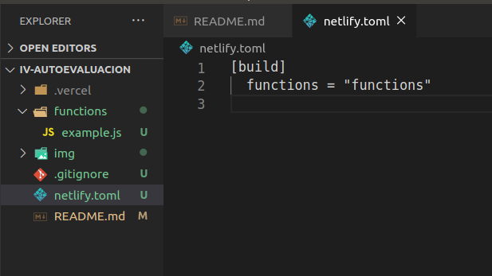

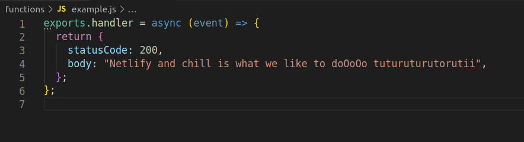

Me logeo con Netlify, le doy autorización a la CLI, y al hacer deploy: 

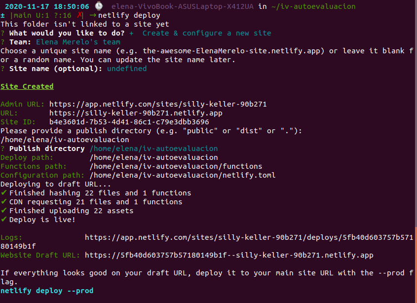

Y ya estaaaAAAAaaá: 

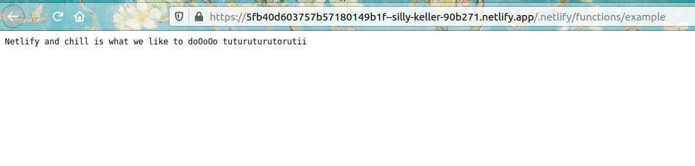